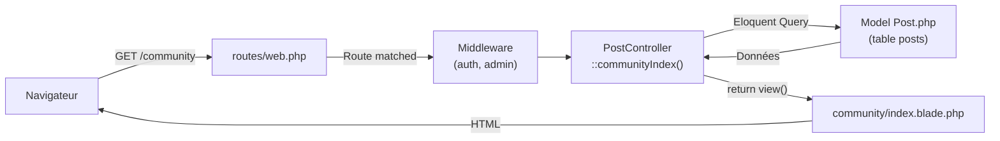
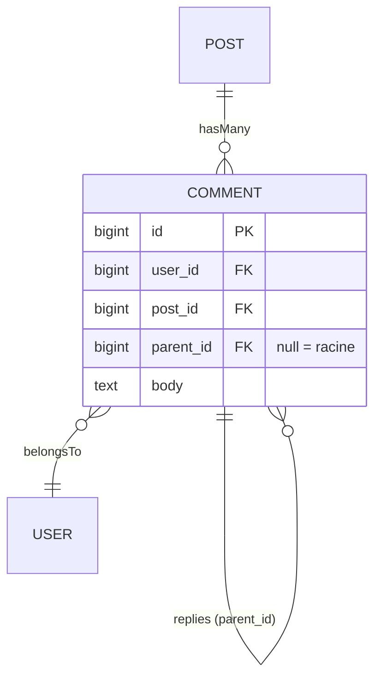
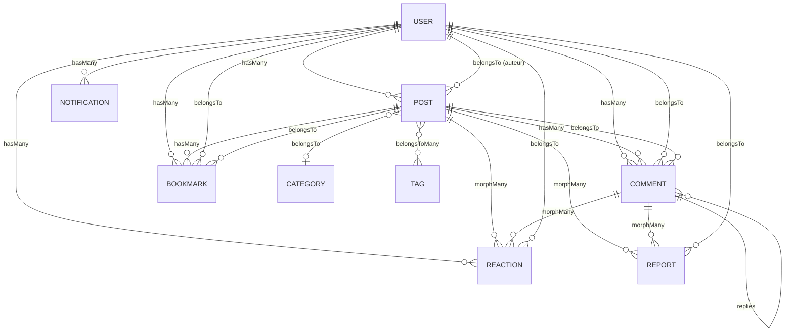

# 📘 Guide d'Apprentissage — Architecture du Blog Laravel

> [!NOTE]
> Ce document est un guide pédagogique complet du projet **Blog Personnel avec Espace Communautaire**. Il explique, composant par composant, **où se trouve chaque fichier**, **quel code il contient** et **comment les pièces s'emboîtent** dans l'architecture MVC de Laravel.

---

## Table des Matières

1. [Vue d'ensemble du projet](#1-vue-densemble-du-projet)
2. [Routes — Le point d'entrée](#2-routes--le-point-dentrée)
3. [Publications (Blog & Communauté)](#3-publications-blog--communauté)
4. [Commentaires & Réponses imbriquées](#4-commentaires--réponses-imbriquées)
5. [Réactions (Emojis polymorphiques)](#5-réactions-emojis-polymorphiques)
6. [Mentions @username & Suggestions](#6-mentions-username--suggestions)
7. [Favoris (Bookmarks)](#7-favoris-bookmarks)
8. [Notifications In-App](#8-notifications-in-app)
9. [Profils Utilisateurs](#9-profils-utilisateurs)
10. [Catégories](#10-catégories)
11. [Modération & Signalements](#11-modération--signalements)
12. [Administration (Dashboard)](#12-administration-dashboard)
13. [Tableau récapitulatif des fichiers](#13-tableau-récapitulatif-des-fichiers)

---

## 1. Vue d'ensemble du projet

Le projet suit l'architecture **MVC** (Modèle–Vue–Contrôleur) de Laravel 11. Voici la structure simplifiée :

```
blog-system/
├── app/
│   ├── Http/
│   │   ├── Controllers/          ← Logique métier (C du MVC)
│   │   │   ├── Admin/            ← Contrôleurs administration
│   │   │   ├── Auth/             ← Contrôleurs authentification
│   │   │   ├── PostController.php
│   │   │   ├── CommentController.php
│   │   │   ├── ReactionController.php
│   │   │   ├── NotificationController.php
│   │   │   ├── ReportController.php
│   │   │   ├── BookmarkController.php
│   │   │   ├── ProfileController.php
│   │   │   ├── CategoryController.php
│   │   │   └── UserController.php
│   │   ├── Requests/             ← Validation des formulaires
│   │   └── Middleware/           ← Filtres (auth, admin)
│   ├── Models/                   ← Modèles Eloquent (M du MVC)
│   │   ├── User.php
│   │   ├── Post.php
│   │   ├── Comment.php
│   │   ├── Reaction.php
│   │   ├── Notification.php
│   │   ├── Report.php
│   │   ├── Bookmark.php
│   │   ├── Category.php
│   │   └── Tag.php
│   ├── Policies/                 ← Règles d'autorisation
│   ├── Events/                   ← Événements temps réel
│   └── Services/                 ← Services métier réutilisables
├── resources/views/              ← Vues Blade (V du MVC)
├── routes/web.php                ← Définition des URL
└── database/migrations/          ← Structure de la BDD
```

### Principe clé : le flux d'une requête HTTP



> [!TIP]
> **Lire dans cet ordre** : Route → Contrôleur → Modèle → Vue. C'est le chemin que suit chaque requête HTTP.

---

## 2. Routes — Le point d'entrée

📁 **Fichier** : [routes/web.php](file:///c:/Users/Powell/Desktop/SGBD/blog-system/routes/web.php)

Ce fichier définit **toutes les URL** de l'application et les relie aux méthodes des contrôleurs. Les routes sont organisées en **4 groupes** :

### A. Routes publiques (accessibles sans connexion)

```php
// Page d'accueil du blog (articles de l'admin)
Route::get('/', [PostController::class, 'blogIndex'])->name('blog.index');

// Espace communautaire (publications des utilisateurs)
Route::get('/community', [PostController::class, 'communityIndex'])->name('community.index');

// Filtrer par catégorie
Route::get('/categories/{slug}', [CategoryController::class, 'show'])->name('categories.show');

// Recherche globale
Route::get('/search', [PostController::class, 'search'])->name('search');

// Voir un post du blog ou de la communauté
Route::get('/blog/{post}', [PostController::class, 'show'])->name('blog.show');
Route::get('/community/{post}', [PostController::class, 'show'])->name('community.show');

// Profil public d'un utilisateur
Route::get('/profile/{username}', [ProfileController::class, 'show'])->name('profile.show');
```

### B. Routes authentifiées (utilisateur connecté uniquement)

```php
Route::middleware(['auth'])->group(function () {
    // --- Profil ---
    Route::get('/profile/edit', [ProfileController::class, 'edit'])->name('profile.edit');
    Route::put('/profile', [ProfileController::class, 'update'])->name('profile.update');
    Route::delete('/profile', [ProfileController::class, 'destroy'])->name('profile.destroy');
    Route::get('/profile/bookmarks', [ProfileController::class, 'bookmarks'])->name('profile.bookmarks');

    // --- CRUD Publications Communautaires ---
    Route::get('/community/create', [PostController::class, 'create'])->name('community.create');
    Route::post('/community', [PostController::class, 'store'])->name('community.store');
    Route::get('/community/{post}/edit', [PostController::class, 'edit'])->name('community.edit');
    Route::put('/community/{post}', [PostController::class, 'update'])->name('community.update');
    Route::delete('/community/{post}', [PostController::class, 'destroy'])->name('community.destroy');

    // --- Commentaires ---
    Route::post('/posts/{post}/comments', [CommentController::class, 'store'])->name('comments.store');
    Route::put('/comments/{comment}', [CommentController::class, 'update'])->name('comments.update');
    Route::delete('/comments/{comment}', [CommentController::class, 'destroy'])->name('comments.destroy');

    // --- Interactions (AJAX) ---
    Route::post('/reactions', [ReactionController::class, 'toggle'])->name('reactions.toggle');
    Route::post('/bookmarks/{post}', [BookmarkController::class, 'toggle'])->name('bookmarks.toggle');
    Route::post('/reports', [ReportController::class, 'store'])->name('reports.store');

    // --- Notifications ---
    Route::get('/notifications', [NotificationController::class, 'index'])->name('notifications.index');
    Route::get('/notifications/unread-count', [NotificationController::class, 'unreadCount']);
    Route::post('/notifications/read-all', [NotificationController::class, 'readAll']);
    Route::post('/notifications/{notification}/read', [NotificationController::class, 'markRead']);

    // --- Suggestion @username ---
    Route::get('/users/search', [UserController::class, 'search'])->name('users.search');
});
```

### C. Routes admin (blog principal)

```php
Route::middleware(['auth', 'admin'])->group(function () {
    Route::get('/blog/create', [PostController::class, 'create'])->name('blog.create');
    Route::post('/blog', [PostController::class, 'store'])->name('blog.store');
    Route::get('/blog/{post}/edit', [PostController::class, 'edit'])->name('blog.edit');
    Route::put('/blog/{post}', [PostController::class, 'update'])->name('blog.update');
    Route::delete('/blog/{post}', [PostController::class, 'destroy'])->name('blog.destroy');
});
```

### D. Routes administration & modération

```php
Route::middleware(['auth', 'admin'])->prefix('admin')->name('admin.')->group(function () {
    Route::get('/', [AdminDashboardController::class, 'index'])->name('dashboard');
    Route::get('/moderation', [ModerationController::class, 'index'])->name('moderation');
    Route::delete('/content/{type}/{id}', [ModerationController::class, 'destroy']);
    Route::post('/reports/{report}/ignore', [ModerationController::class, 'ignore']);
    Route::post('/users/{user}/block', [ModerationController::class, 'block']);
    Route::post('/users/{user}/unblock', [ModerationController::class, 'unblock']);
    Route::get('/categories', [CategoryController::class, 'adminIndex'])->name('categories');
    Route::post('/categories', [CategoryController::class, 'store']);
    Route::delete('/categories/{category}', [CategoryController::class, 'destroy']);
});
```

> [!IMPORTANT]
> **Les middlewares `auth` et `admin`** protègent les routes sensibles. Un visiteur non connecté est redirigé vers la connexion. Un utilisateur non-admin reçoit une erreur 403.

---

## 3. Publications (Blog & Communauté)

C'est le composant central du système. Une seule table `posts` gère les deux espaces grâce au champ `type` (`BLOG` ou `COMMUNITY`).

### Fichiers impliqués

| Rôle | Fichier |
|:---|:---|
| Modèle | [app/Models/Post.php](file:///c:/Users/Powell/Desktop/SGBD/blog-system/app/Models/Post.php) |
| Contrôleur | [app/Http/Controllers/PostController.php](file:///c:/Users/Powell/Desktop/SGBD/blog-system/app/Http/Controllers/PostController.php) |
| Policy | [app/Policies/PostPolicy.php](file:///c:/Users/Powell/Desktop/SGBD/blog-system/app/Policies/PostPolicy.php) |

### A. Le Modèle `Post`

Le modèle définit les relations avec les autres tables et contient la logique métier :

```php
<?php

namespace App\Models;

class Post extends Model
{
    // ──────────────────────────────────────────────
    // CONSTANTES : distinguer les deux espaces
    // ──────────────────────────────────────────────
    public const TYPE_BLOG = 'BLOG';
    public const TYPE_COMMUNITY = 'COMMUNITY';

    protected $fillable = [
        'user_id', 'category_id', 'type', 'title', 'body',
        'reading_time', 'cover_image_url', 'status',
        'published_at', 'is_featured', 'slug', 'meta_description',
    ];

    // ──────────────────────────────────────────────
    // HOOK « saving » : calculs automatiques
    // ──────────────────────────────────────────────
    protected static function booted(): void
    {
        static::saving(function (Post $post) {
            // Calcul automatique du temps de lecture
            if ($post->isDirty('body')) {
                $post->reading_time = static::calculateReadingTime($post->body ?? '');
            }
            // Génération automatique du slug
            if (empty($post->slug) && $post->title) {
                $post->slug = \Illuminate\Support\Str::slug($post->title);
            }
            // Date de publication auto
            if ($post->isDirty('status') && $post->status === 'published' && empty($post->published_at)) {
                $post->published_at = now();
            }
        });
    }

    // Formule du CDC : nombre_de_mots ÷ 200, arrondi supérieur
    public static function calculateReadingTime(string $body): int
    {
        $wordCount = str_word_count(strip_tags($body));
        return (int) max(1, (int) ceil($wordCount / 200));
    }

    // ──────────────────────────────────────────────
    // RELATIONS Eloquent
    // ──────────────────────────────────────────────
    public function user(): BelongsTo        { return $this->belongsTo(User::class); }
    public function category(): BelongsTo    { return $this->belongsTo(Category::class); }
    public function comments(): HasMany      { return $this->hasMany(Comment::class); }
    public function bookmarks(): HasMany     { return $this->hasMany(Bookmark::class); }
    public function tags(): BelongsToMany    { return $this->belongsToMany(Tag::class); }

    // Relations POLYMORPHIQUES (la même table sert pour Post ET Comment)
    public function reactions(): MorphMany   { return $this->morphMany(Reaction::class, 'reactable'); }
    public function reports(): MorphMany     { return $this->morphMany(Report::class, 'reportable'); }

    // Commentaires racines uniquement (pas les réponses)
    public function rootComments(): HasMany
    {
        return $this->hasMany(Comment::class)->whereNull('parent_id')->latest();
    }

    // ──────────────────────────────────────────────
    // SCOPES : filtres réutilisables dans les requêtes
    // ──────────────────────────────────────────────
    public function scopeBlog(Builder $query): Builder      { return $query->where('type', self::TYPE_BLOG); }
    public function scopeCommunity(Builder $query): Builder { return $query->where('type', self::TYPE_COMMUNITY); }
    public function scopeRecent(Builder $query): Builder    { return $query->orderByDesc('created_at'); }
    public function scopePublished(Builder $query): Builder { return $query->where('status', 'published'); }

    // ──────────────────────────────────────────────
    // ACCESSEURS : attributs calculés dynamiquement
    // ──────────────────────────────────────────────
    public function isBlog(): bool      { return $this->type === self::TYPE_BLOG; }
    public function isCommunity(): bool { return $this->type === self::TYPE_COMMUNITY; }

    public function getReadingTimeLabelAttribute(): string
    {
        $minutes = $this->reading_time ?? static::calculateReadingTime($this->body ?? '');
        return "Lecture : {$minutes} min";
    }
}
```

> [!TIP]
> **Les Scopes** (`scopeBlog`, `scopeCommunity`, `scopeRecent`) permettent d'écrire des requêtes lisibles :
> ```php
> Post::blog()->recent()->paginate(10);     // Articles du blog, les plus récents
> Post::community()->paginate(10);           // Publications communautaires
> ```

### B. La Policy `PostPolicy`

La Policy contrôle **qui peut faire quoi** sur les publications :

```php
<?php

namespace App\Policies;

class PostPolicy
{
    // Seul l'admin peut créer dans le Blog
    public function createBlog(User $user): bool
    {
        return $user->is_admin;
    }

    // Tout utilisateur authentifié peut publier dans la Communauté
    public function createCommunity(User $user): bool
    {
        return true;
    }

    // Seul l'auteur OU l'admin peut modifier
    public function update(User $user, Post $post): bool
    {
        return $user->id === $post->user_id || $user->is_admin;
    }

    // Seul l'auteur OU l'admin peut supprimer
    public function delete(User $user, Post $post): bool
    {
        return $user->id === $post->user_id || $user->is_admin;
    }
}
```

### C. Le Contrôleur `PostController`

Le contrôleur reçoit les requêtes HTTP et orchestre la logique. Voici les méthodes clés expliquées :

```php
<?php

namespace App\Http\Controllers;

class PostController extends Controller
{
    // Injection du service de notifications via le constructeur
    public function __construct(private NotificationService $notifications) {}

    // ──────────────────────────────────────────────
    // AFFICHAGE : pages de listing
    // ──────────────────────────────────────────────

    // GET / → Page d'accueil du blog principal
    public function blogIndex(Request $request): View
    {
        $featured = Post::query()
            ->blog()                          // Scope : type = BLOG
            ->whereNotNull('cover_image_url') // Avec image de couverture
            ->latest()
            ->first();                        // Article mis en avant

        $posts = Post::query()
            ->blog()
            ->with(['user', 'category'])      // Eager loading (évite le N+1)
            ->recent()
            ->paginate(10);                   // 10 articles par page

        $categories = Category::query()->orderBy('name')->get();

        return view('blog.index', compact('posts', 'categories', 'featured'));
    }

    // GET /community → Page de l'espace communautaire
    public function communityIndex(Request $request): View
    {
        $posts = Post::query()
            ->community()                     // Scope : type = COMMUNITY
            ->with(['user', 'category', 'reactions'])
            ->recent()
            ->paginate(10);

        $categories = Category::query()->orderBy('name')->get();

        return view('community.index', compact('posts', 'categories'));
    }

    // ──────────────────────────────────────────────
    // AFFICHAGE : page de détail d'un post
    // ──────────────────────────────────────────────

    // GET /blog/{post} ou /community/{post}
    public function show(Post $post): View
    {
        // Chargement des relations imbriquées
        $post->load(['user', 'category']);
        $post->load([
            'rootComments' => fn ($q) => $q->with([
                'user',                   // Auteur du commentaire
                'replies.user',           // Auteurs des réponses
                'reactions',              // Réactions sur le commentaire
                'replies.reactions'       // Réactions sur les réponses
            ]),
            'reactions',
        ]);

        // Vérifier si l'utilisateur connecté a ajouté en favoris
        $isBookmarked = false;
        if (auth()->check()) {
            $isBookmarked = Bookmark::query()
                ->where('user_id', auth()->id())
                ->where('post_id', $post->id)
                ->exists();
        }

        return view('posts.show', [
            'post' => $post,
            'context' => $post->isBlog() ? 'blog' : 'community',
            'isBookmarked' => $isBookmarked,
        ]);
    }

    // ──────────────────────────────────────────────
    // CRÉATION
    // ──────────────────────────────────────────────

    // POST /blog ou POST /community
    public function store(StorePostRequest $request): RedirectResponse
    {
        $type = $this->resolveTypeFromRoute($request);

        // Vérification des autorisations via la Policy
        if ($type === Post::TYPE_BLOG) {
            $this->authorize('createBlog', Post::class);
        } else {
            $this->authorize('createCommunity', Post::class);
        }

        $data = [
            'user_id'     => $request->user()->id,
            'category_id' => $request->validated('category_id'),
            'type'        => $type,
            'title'       => $request->validated('title'),
            'body'        => $request->validated('body'),
            'status'      => $request->input('status', 'draft'),
            // ... autres champs
        ];

        // Upload d'image via Cloudinary si présente
        if ($request->hasFile('cover_image')) {
            // Configuration et upload Cloudinary...
            $data['cover_image_url'] = $result['secure_url'];
        }

        $post = Post::create($data);

        // Sync des tags (relation BelongsToMany)
        if ($request->filled('tags')) {
            $tagNames = array_map('trim', explode(',', $request->input('tags')));
            $tagIds = [];
            foreach ($tagNames as $tagName) {
                if ($tagName === '') continue;
                $tag = Tag::firstOrCreate(
                    ['slug' => Str::slug($tagName)],
                    ['name' => $tagName]
                );
                $tagIds[] = $tag->id;
            }
            $post->tags()->sync($tagIds);
        }

        // Notification des utilisateurs mentionnés via @username
        $this->notifications->notifyMentions($post->body, $post, $post);

        return redirect()->to($this->postShowRoute($post))->with('success', '...');
    }

    // ──────────────────────────────────────────────
    // RECHERCHE
    // ──────────────────────────────────────────────

    // GET /search?q=mot-clé
    public function search(Request $request): View
    {
        $query = trim((string) $request->get('q', ''));

        $posts = Post::query()
            ->when($query !== '', function ($q) use ($query) {
                $q->where(function ($builder) use ($query) {
                    $builder->where('title', 'like', "%{$query}%")
                        ->orWhere('body', 'like', "%{$query}%");
                });
            })
            ->with(['user', 'category'])
            ->recent()
            ->paginate(10)
            ->withQueryString(); // Conserve le paramètre ?q= dans la pagination

        return view('posts.search', compact('posts', 'query'));
    }

    // ──────────────────────────────────────────────
    // MÉTHODES UTILITAIRES PRIVÉES
    // ──────────────────────────────────────────────

    // Détermine le type (BLOG ou COMMUNITY) en fonction de la route
    private function resolveTypeFromRoute(Request $request): string
    {
        return $request->routeIs('blog.*') ? Post::TYPE_BLOG : Post::TYPE_COMMUNITY;
    }

    // Génère l'URL de détail selon le type
    private function postShowRoute(Post $post): string
    {
        return $post->isBlog()
            ? route('blog.show', $post)
            : route('community.show', $post);
    }
}
```

> [!IMPORTANT]
> **Un seul contrôleur** gère les deux espaces (Blog et Communauté). La méthode `resolveTypeFromRoute()` détermine automatiquement le type en fonction de l'URL appelée (`/blog/*` → BLOG, `/community/*` → COMMUNITY).

---

## 4. Commentaires & Réponses imbriquées

Les commentaires supportent les réponses en threads grâce à la colonne `parent_id` (auto-référence).

### Fichiers impliqués

| Rôle | Fichier |
|:---|:---|
| Modèle | [app/Models/Comment.php](file:///c:/Users/Powell/Desktop/SGBD/blog-system/app/Models/Comment.php) |
| Contrôleur | [app/Http/Controllers/CommentController.php](file:///c:/Users/Powell/Desktop/SGBD/blog-system/app/Http/Controllers/CommentController.php) |
| Policy | [app/Policies/CommentPolicy.php](file:///c:/Users/Powell/Desktop/SGBD/blog-system/app/Policies/CommentPolicy.php) |

### A. Le Modèle `Comment`

```php
<?php

namespace App\Models;

class Comment extends Model
{
    protected $fillable = ['user_id', 'post_id', 'parent_id', 'body'];

    // ── Relations ──
    public function user(): BelongsTo    { return $this->belongsTo(User::class); }
    public function post(): BelongsTo    { return $this->belongsTo(Post::class); }

    // Auto-référence pour les threads imbriqués
    public function parent(): BelongsTo  { return $this->belongsTo(Comment::class, 'parent_id'); }
    public function replies(): HasMany   { return $this->hasMany(Comment::class, 'parent_id')->orderBy('created_at'); }

    // Polymorphisme (réactions et signalements)
    public function reactions(): MorphMany { return $this->morphMany(Reaction::class, 'reactable'); }
    public function reports(): MorphMany   { return $this->morphMany(Report::class, 'reportable'); }

    // ── Méthodes utilitaires ──
    public function isReply(): bool    { return $this->parent_id !== null; }
    public function wasEdited(): bool  { return $this->updated_at->gt($this->created_at); }
}
```



### B. La Policy `CommentPolicy`

```php
<?php

namespace App\Policies;

class CommentPolicy
{
    public function create(User $user): bool
    {
        return true;   // Tout utilisateur connecté peut commenter
    }

    public function update(User $user, Comment $comment): bool
    {
        return $user->id === $comment->user_id;   // Seul l'auteur
    }

    public function delete(User $user, Comment $comment): bool
    {
        return $user->id === $comment->user_id || $user->is_admin;  // Auteur OU admin
    }
}
```

### C. Le Contrôleur `CommentController`

```php
<?php

namespace App\Http\Controllers;

class CommentController extends Controller
{
    public function __construct(private NotificationService $notifications) {}

    // POST /posts/{post}/comments
    public function store(StoreCommentRequest $request, Post $post): JsonResponse|RedirectResponse
    {
        $this->authorize('create', Comment::class);

        $parentId = $request->validated('parent_id');
        $parent = null;

        // Si c'est une RÉPONSE, on vérifie que le parent existe et appartient au bon post
        if ($parentId) {
            $parent = Comment::query()->with('user')->findOrFail($parentId);
            if ($parent->post_id !== $post->id) {
                abort(422, 'Le commentaire parent n\'appartient pas à cette publication.');
            }
        }

        $comment = Comment::create([
            'user_id'   => $request->user()->id,
            'post_id'   => $post->id,
            'parent_id' => $parentId,    // null = commentaire racine
            'body'      => $request->validated('body'),
        ]);

        $comment->load('user');

        // ── Notifications ──
        if ($parent) {
            // Notifier l'auteur du commentaire parent qu'il a reçu une réponse
            $this->notifications->notifyReply($parent, $comment);
        } else {
            // Notifier l'auteur du post qu'il a reçu un commentaire
            $this->notifications->notifyComment($post, $comment);
        }

        // Notifier les utilisateurs mentionnés avec @username
        $this->notifications->notifyMentions($comment->body, $comment, $post);

        // Émettre un événement temps réel (WebSocket via Laravel Reverb)
        CommentPosted::dispatch($comment);

        if ($request->expectsJson()) {
            return response()->json(['success' => true, 'comment' => $comment]);
        }

        return back()->with('success', 'Commentaire publié.');
    }

    // PUT /comments/{comment}
    public function update(StoreCommentRequest $request, Comment $comment): JsonResponse|RedirectResponse
    {
        $this->authorize('update', $comment);   // Policy : seul l'auteur
        $comment->update(['body' => $request->validated('body')]);
        $this->notifications->notifyMentions($comment->body, $comment, $comment->post);

        return $request->expectsJson()
            ? response()->json(['success' => true, 'comment' => $comment->fresh()])
            : back()->with('success', 'Commentaire modifié.');
    }

    // DELETE /comments/{comment}
    public function destroy(Request $request, Comment $comment): JsonResponse|RedirectResponse
    {
        $this->authorize('delete', $comment);   // Policy : auteur OU admin
        $comment->delete();

        return $request->expectsJson()
            ? response()->json(['success' => true])
            : back()->with('success', 'Commentaire supprimé.');
    }
}
```

> [!TIP]
> Le contrôleur supporte à la fois les **requêtes classiques** (formulaire HTML → redirection) et les **requêtes AJAX** (JSON). Le test `$request->expectsJson()` détermine le format de réponse.

---

## 5. Réactions (Emojis polymorphiques)

Le système de réactions est **polymorphique** : la même table `reactions` et le même code servent pour réagir à un `Post` ou à un `Comment`.

### Fichiers impliqués

| Rôle | Fichier |
|:---|:---|
| Modèle | [app/Models/Reaction.php](file:///c:/Users/Powell/Desktop/SGBD/blog-system/app/Models/Reaction.php) |
| Contrôleur | [app/Http/Controllers/ReactionController.php](file:///c:/Users/Powell/Desktop/SGBD/blog-system/app/Http/Controllers/ReactionController.php) |

### A. Le Modèle `Reaction`

```php
<?php

namespace App\Models;

class Reaction extends Model
{
    public const TYPE_LOVE = 'love';
    public const TYPES = [self::TYPE_LOVE];
    public const LABELS = [self::TYPE_LOVE => "J'adore"];
    public const EMOJIS = [self::TYPE_LOVE => '❤️'];

    protected $fillable = ['user_id', 'reactable_id', 'reactable_type', 'type'];

    public function user(): BelongsTo { return $this->belongsTo(User::class); }

    // Relation polymorphique : peut pointer vers un Post OU un Comment
    public function reactable(): MorphTo { return $this->morphTo(); }

    public function getEmojiAttribute(): string { return self::EMOJIS[$this->type] ?? ''; }
    public function getLabelAttribute(): string { return self::LABELS[$this->type] ?? $this->type; }
}
```

### B. Le Contrôleur `ReactionController` — Logique de Toggle

```php
<?php

namespace App\Http\Controllers;

class ReactionController extends Controller
{
    public function __construct(private NotificationService $notifications) {}

    // POST /reactions (AJAX)
    public function toggle(Request $request): JsonResponse
    {
        $validated = $request->validate([
            'reactable_type' => ['required', Rule::in(['post', 'comment'])],
            'reactable_id'   => ['required', 'integer'],
            'type'           => ['required', Rule::in(Reaction::TYPES)],
        ]);

        // Résoudre la cible (Post ou Comment)
        $reactable = match ($validated['reactable_type']) {
            'post'    => Post::findOrFail($validated['reactable_id']),
            'comment' => Comment::findOrFail($validated['reactable_id']),
        };

        // Chercher une réaction existante de cet utilisateur sur cette cible
        $existing = Reaction::query()
            ->where('user_id', $request->user()->id)
            ->where('reactable_id', $reactable->id)
            ->where('reactable_type', $reactable->getMorphClass())
            ->first();

        if ($existing && $existing->type === $validated['type']) {
            // MÊME réaction → la SUPPRIMER (toggle off)
            $existing->delete();
        } elseif ($existing) {
            // AUTRE réaction → la REMPLACER
            $existing->update(['type' => $validated['type']]);
        } else {
            // AUCUNE réaction → en CRÉER une nouvelle
            $reaction = Reaction::create([
                'user_id'        => $request->user()->id,
                'reactable_id'   => $reactable->id,
                'reactable_type' => $reactable->getMorphClass(),
                'type'           => $validated['type'],
            ]);
            $this->notifications->notifyReaction($reactable->user, $reaction, $reactable);
        }

        // Retourner les compteurs mis à jour + la réaction active de l'utilisateur
        return response()->json([
            'success'       => true,
            'counts'        => $this->reactionCounts($reactable),
            'user_reaction' => Reaction::query()
                ->where('user_id', $request->user()->id)
                ->where('reactable_id', $reactable->id)
                ->where('reactable_type', $reactable->getMorphClass())
                ->value('type'),
        ]);
    }
}
```

> [!NOTE]
> **Le polymorphisme expliqué** : La colonne `reactable_type` stocke le nom de la classe cible (`App\Models\Post` ou `App\Models\Comment`) et `reactable_id` stocke l'ID de l'enregistrement. Cela permet à **une seule table** de gérer les réactions pour les deux types d'entités.

---

## 6. Mentions @username & Suggestions

Quand un utilisateur tape `@` dans un champ texte, une requête AJAX est envoyée pour afficher des suggestions. Lors de la soumission, le système parse le texte pour envoyer des notifications aux utilisateurs mentionnés.

### Fichiers impliqués

| Rôle | Fichier |
|:---|:---|
| API suggestions | [app/Http/Controllers/UserController.php](file:///c:/Users/Powell/Desktop/SGBD/blog-system/app/Http/Controllers/UserController.php) |
| Parsing & notifications | [app/Services/NotificationService.php](file:///c:/Users/Powell/Desktop/SGBD/blog-system/app/Services/NotificationService.php) |

### A. API de recherche d'utilisateurs

```php
<?php

namespace App\Http\Controllers;

class UserController extends Controller
{
    // GET /users/search?q=trea (AJAX)
    public function search(Request $request): JsonResponse
    {
        $query = trim((string) $request->get('q', ''));

        if (strlen($query) < 1) {
            return response()->json(['users' => []]);
        }

        // Recherche par préfixe du username, exclure les utilisateurs bloqués
        $users = User::query()
            ->where('username', 'like', $query.'%')
            ->where('is_blocked', false)
            ->limit(10)
            ->get(['id', 'username', 'name', 'avatar']);

        return response()->json([
            'users' => $users->map(fn (User $user) => [
                'id'         => $user->id,
                'username'   => $user->username,
                'name'       => $user->name,
                'avatar_url' => $user->avatar_url,
            ]),
        ]);
    }
}
```

### B. Parsing des mentions dans le `NotificationService`

```php
// Méthode dans app/Services/NotificationService.php
public function notifyMentions(string $body, Model $notifiable, Post $post): void
{
    // Regex : cherche tous les @username (3 à 30 caractères alphanumériques + underscore)
    preg_match_all('/@([a-zA-Z0-9_]{3,30})/', $body, $matches);
    $usernames = array_unique($matches[1] ?? []);

    if ($usernames === []) {
        return;
    }

    // Trouver les utilisateurs correspondants en base
    $users = User::query()->whereIn('username', $usernames)->get();

    foreach ($users as $user) {
        $this->notify($user, Notification::TYPE_MENTION, $notifiable, [
            'message' => auth()->user()->name.' vous a mentionné.',
            'post_id' => $post->id,
            'url'     => $this->postUrl($post),
        ]);
    }
}
```

---

## 7. Favoris (Bookmarks)

Les utilisateurs peuvent sauvegarder des publications. C'est un simple **toggle** (ajouter/retirer).

### Fichiers impliqués

| Rôle | Fichier |
|:---|:---|
| Modèle | [app/Models/Bookmark.php](file:///c:/Users/Powell/Desktop/SGBD/blog-system/app/Models/Bookmark.php) |
| Contrôleur | [app/Http/Controllers/BookmarkController.php](file:///c:/Users/Powell/Desktop/SGBD/blog-system/app/Http/Controllers/BookmarkController.php) |
| Liste des favoris | [app/Http/Controllers/ProfileController.php](file:///c:/Users/Powell/Desktop/SGBD/blog-system/app/Http/Controllers/ProfileController.php) → `bookmarks()` |

### A. Le Modèle `Bookmark`

```php
<?php

namespace App\Models;

class Bookmark extends Model
{
    public const UPDATED_AT = null;   // Pas de colonne updated_at
    protected $fillable = ['user_id', 'post_id'];

    public function user(): BelongsTo { return $this->belongsTo(User::class); }
    public function post(): BelongsTo { return $this->belongsTo(Post::class); }
}
```

### B. Le Contrôleur `BookmarkController`

```php
<?php

namespace App\Http\Controllers;

class BookmarkController extends Controller
{
    // POST /bookmarks/{post} (AJAX)
    public function toggle(Request $request, Post $post): JsonResponse
    {
        $this->authorize('create', Bookmark::class);

        $bookmark = Bookmark::query()
            ->where('user_id', $request->user()->id)
            ->where('post_id', $post->id)
            ->first();

        if ($bookmark) {
            $bookmark->delete();       // Retirer des favoris
            $bookmarked = false;
        } else {
            Bookmark::create([         // Ajouter aux favoris
                'user_id' => $request->user()->id,
                'post_id' => $post->id,
            ]);
            $bookmarked = true;
        }

        return response()->json([
            'success'    => true,
            'bookmarked' => $bookmarked,
        ]);
    }
}
```

---

## 8. Notifications In-App

Le système utilise une table `notifications` personnalisée (pas le système natif de Laravel) avec des **relations polymorphiques**.

### Fichiers impliqués

| Rôle | Fichier |
|:---|:---|
| Modèle | [app/Models/Notification.php](file:///c:/Users/Powell/Desktop/SGBD/blog-system/app/Models/Notification.php) |
| Contrôleur | [app/Http/Controllers/NotificationController.php](file:///c:/Users/Powell/Desktop/SGBD/blog-system/app/Http/Controllers/NotificationController.php) |
| Service central | [app/Services/NotificationService.php](file:///c:/Users/Powell/Desktop/SGBD/blog-system/app/Services/NotificationService.php) |

### A. Le Modèle `Notification`

```php
<?php

namespace App\Models;

class Notification extends Model
{
    // 4 types d'événements qui déclenchent une notification
    public const TYPE_COMMENT  = 'comment';   // Quelqu'un commente votre post
    public const TYPE_REPLY    = 'reply';     // Quelqu'un répond à votre commentaire
    public const TYPE_REACTION = 'reaction';  // Quelqu'un réagit à votre contenu
    public const TYPE_MENTION  = 'mention';   // Quelqu'un vous mentionne avec @username

    public $timestamps = false;   // Gestion manuelle du created_at

    protected $fillable = ['user_id', 'type', 'notifiable_id', 'notifiable_type', 'data', 'read_at'];

    protected function casts(): array
    {
        return [
            'data'       => 'array',      // JSON stocké comme tableau PHP
            'read_at'    => 'datetime',
            'created_at' => 'datetime',
        ];
    }

    // Auto-set created_at à la création
    protected static function booted(): void
    {
        static::creating(function (Notification $notification) {
            if (! $notification->created_at) {
                $notification->created_at = now();
            }
        });
    }

    public function user(): BelongsTo      { return $this->belongsTo(User::class); }
    public function notifiable(): MorphTo   { return $this->morphTo(); }
    public function scopeUnread(Builder $q) { return $q->whereNull('read_at'); }
    public function isRead(): bool          { return $this->read_at !== null; }

    public function markAsRead(): void
    {
        if ($this->read_at === null) {
            $this->update(['read_at' => now()]);
        }
    }
}
```

### B. Le Service `NotificationService`

Ce service centralise **toute la logique de création** de notifications. Il est injecté dans les contrôleurs qui en ont besoin.

```php
<?php

namespace App\Services;

class NotificationService
{
    // Méthode générique : ne notifie PAS soi-même
    public function notify(User $recipient, string $type, Model $notifiable, array $data = []): void
    {
        if ($recipient->id === auth()->id()) {
            return;    // Ne pas se notifier soi-même
        }

        Notification::create([
            'user_id'         => $recipient->id,
            'type'            => $type,
            'notifiable_id'   => $notifiable->id,
            'notifiable_type' => $notifiable->getMorphClass(),
            'data'            => $data,
        ]);
    }

    // "X a commenté votre publication" → notifier l'auteur du post
    public function notifyComment(Post $post, Comment $comment): void
    {
        $this->notify($post->user, Notification::TYPE_COMMENT, $comment, [
            'message' => auth()->user()->name.' a commenté votre publication.',
            'post_id' => $post->id,
            'url'     => $this->postUrl($post),
        ]);
    }

    // "X a répondu à votre commentaire" → notifier l'auteur du commentaire parent
    public function notifyReply(Comment $parent, Comment $reply): void { /* ... */ }

    // "X a réagi à votre contenu" → notifier l'auteur
    public function notifyReaction(User $author, Reaction $reaction, Model $reactable): void { /* ... */ }

    // "X vous a mentionné" → parser @username et notifier chaque personne
    public function notifyMentions(string $body, Model $notifiable, Post $post): void { /* ... */ }
}
```

### C. Le Contrôleur `NotificationController`

```php
<?php

namespace App\Http\Controllers;

class NotificationController extends Controller
{
    // GET /notifications → Liste paginée
    public function index(Request $request): View|JsonResponse { /* ... */ }

    // GET /notifications/unread-count → Compteur pour l'icône cloche
    public function unreadCount(Request $request): JsonResponse
    {
        return response()->json([
            'count' => Notification::query()
                ->where('user_id', $request->user()->id)
                ->unread()
                ->count(),
        ]);
    }

    // POST /notifications/read-all → Tout marquer comme lu
    public function readAll(Request $request): JsonResponse|RedirectResponse
    {
        Notification::query()
            ->where('user_id', $request->user()->id)
            ->whereNull('read_at')
            ->update(['read_at' => now()]);
        // ...
    }

    // POST /notifications/{notification}/read → Marquer une notification et rediriger
    public function markRead(Request $request, Notification $notification): JsonResponse|RedirectResponse
    {
        $notification->markAsRead();
        $url = $notification->data['url'] ?? route('notifications.index');
        return redirect($url);    // Redirige vers le contenu concerné
    }
}
```

---

## 9. Profils Utilisateurs

### Fichiers impliqués

| Rôle | Fichier |
|:---|:---|
| Modèle | [app/Models/User.php](file:///c:/Users/Powell/Desktop/SGBD/blog-system/app/Models/User.php) |
| Contrôleur | [app/Http/Controllers/ProfileController.php](file:///c:/Users/Powell/Desktop/SGBD/blog-system/app/Http/Controllers/ProfileController.php) |

### A. Le Modèle `User`

```php
<?php

namespace App\Models;

class User extends Authenticatable
{
    use HasFactory, Notifiable;

    protected $fillable = ['username', 'name', 'email', 'password', 'avatar', 'bio', 'is_admin', 'is_blocked'];
    protected $hidden = ['password', 'remember_token'];

    protected function casts(): array
    {
        return [
            'email_verified_at' => 'datetime',
            'password'          => 'hashed',     // Hash automatique à l'écriture
            'is_admin'          => 'boolean',
            'is_blocked'        => 'boolean',
        ];
    }

    // ── Relations ──
    public function posts(): HasMany         { return $this->hasMany(Post::class); }
    public function comments(): HasMany      { return $this->hasMany(Comment::class); }
    public function notifications(): HasMany { return $this->hasMany(Notification::class); }
    public function bookmarks(): HasMany     { return $this->hasMany(Bookmark::class); }
    public function reactions(): HasMany     { return $this->hasMany(Reaction::class); }

    // Uniquement les posts communautaires de l'utilisateur
    public function communityPosts(): HasMany
    {
        return $this->hasMany(Post::class)->where('type', Post::TYPE_COMMUNITY);
    }

    // ── Méthodes de vérification ──
    public function isAdmin(): bool   { return $this->is_admin === true; }
    public function isBlocked(): bool { return $this->is_blocked === true; }

    // ── Avatar avec fallback ──
    public function getAvatarUrlAttribute(): string
    {
        if ($this->avatar) {
            if (str_starts_with($this->avatar, 'http')) {
                return $this->avatar;
            }
            return asset('storage/'.$this->avatar);
        }
        // Avatar généré automatiquement si aucune photo n'est uploadée
        return 'https://ui-avatars.com/api/?name='.urlencode($this->name).'&background=0F172A&color=fff';
    }

    // Résolution par username au lieu de l'ID dans les routes
    public function getRouteKeyName(): string
    {
        return 'username';
    }
}
```

### B. Le Contrôleur `ProfileController`

```php
<?php

namespace App\Http\Controllers;

class ProfileController extends Controller
{
    // GET /profile/{username} → Page publique
    public function show(string $username): View
    {
        $user = User::query()->where('username', $username)->firstOrFail();

        $posts = $user->communityPosts()
            ->with('category')
            ->recent()
            ->paginate(10);

        // Compteurs calculés dynamiquement (pas de colonne dédiée)
        $postsCount = $user->posts()->community()->count();
        $commentsCount = $user->comments()->count();

        return view('profile.show', compact('user', 'posts', 'postsCount', 'commentsCount'));
    }

    // PUT /profile → Mise à jour du profil
    public function update(ProfileUpdateRequest $request): RedirectResponse
    {
        $user = $request->user();
        $user->fill($request->safe()->only(['name', 'bio']));

        // Upload de la photo de profil
        if ($request->hasFile('avatar')) {
            if ($user->avatar) {
                Storage::disk('public')->delete($user->avatar);  // Supprimer l'ancienne
            }
            $user->avatar = $request->file('avatar')->store('avatars', 'public');
        }

        // Changement de mot de passe (optionnel)
        if ($request->filled('password')) {
            $user->password = Hash::make($request->validated('password'));
        }

        $user->save();
        return Redirect::route('profile.edit')->with('success', 'Profil mis à jour.');
    }

    // GET /profile/bookmarks → Liste privée des favoris
    public function bookmarks(Request $request): View
    {
        $bookmarks = Bookmark::query()
            ->where('user_id', $request->user()->id)
            ->with(['post.user', 'post.category'])
            ->latest('created_at')
            ->paginate(10);

        return view('profile.bookmarks', compact('bookmarks'));
    }

    // DELETE /profile → Suppression du compte
    public function destroy(Request $request): RedirectResponse
    {
        $request->validateWithBag('userDeletion', [
            'password' => ['required', 'current_password'],
        ]);

        $user = $request->user();
        Auth::logout();
        $user->delete();

        $request->session()->invalidate();
        $request->session()->regenerateToken();

        return Redirect::to('/');
    }
}
```

---

## 10. Catégories

Les catégories permettent de classer les publications et de les filtrer.

### Fichiers impliqués

| Rôle | Fichier |
|:---|:---|
| Modèle | [app/Models/Category.php](file:///c:/Users/Powell/Desktop/SGBD/blog-system/app/Models/Category.php) |
| Contrôleur | [app/Http/Controllers/CategoryController.php](file:///c:/Users/Powell/Desktop/SGBD/blog-system/app/Http/Controllers/CategoryController.php) |

### Le Modèle `Category`

```php
<?php

namespace App\Models;

class Category extends Model
{
    protected $fillable = ['name', 'slug'];

    // Génération automatique du slug à partir du nom
    protected static function booted(): void
    {
        static::saving(function (Category $category) {
            if (empty($category->slug) && ! empty($category->name)) {
                $category->slug = Str::slug($category->name);
            }
        });
    }

    public function posts(): HasMany { return $this->hasMany(Post::class); }

    // Résolution par slug dans les routes (au lieu de l'ID)
    public function getRouteKeyName(): string { return 'slug'; }
}
```

### Le Contrôleur `CategoryController`

```php
<?php

namespace App\Http\Controllers;

class CategoryController extends Controller
{
    // GET /categories/{slug} → Page publique : publications de cette catégorie
    public function show(string $slug): View
    {
        $category = Category::query()->where('slug', $slug)->firstOrFail();
        $posts = Post::query()
            ->where('category_id', $category->id)
            ->with(['user', 'category'])
            ->recent()
            ->paginate(10);

        return view('categories.show', compact('category', 'posts'));
    }

    // GET /admin/categories → Administration des catégories
    public function adminIndex(): View
    {
        $categories = Category::query()->withCount('posts')->orderBy('name')->get();
        return view('admin.categories', compact('categories'));
    }

    // POST /admin/categories → Créer une catégorie
    public function store(Request $request): RedirectResponse
    {
        $validated = $request->validate([
            'name' => ['required', 'string', 'max:100', 'unique:categories,name'],
        ]);
        Category::create($validated);
        return back()->with('success', 'Catégorie créée.');
    }

    // DELETE /admin/categories/{category} → Supprimer une catégorie
    public function destroy(Category $category): RedirectResponse
    {
        $category->delete();
        return back()->with('success', 'Catégorie supprimée.');
    }
}
```

---

## 11. Modération & Signalements

Les utilisateurs peuvent signaler du contenu inapproprié. Les signalements sont **polymorphiques** (ils peuvent viser un `Post` ou un `Comment`).

### Fichiers impliqués

| Rôle | Fichier |
|:---|:---|
| Modèle | [app/Models/Report.php](file:///c:/Users/Powell/Desktop/SGBD/blog-system/app/Models/Report.php) |
| Contrôleur (utilisateur) | [app/Http/Controllers/ReportController.php](file:///c:/Users/Powell/Desktop/SGBD/blog-system/app/Http/Controllers/ReportController.php) |
| Contrôleur (admin) | [app/Http/Controllers/Admin/ModerationController.php](file:///c:/Users/Powell/Desktop/SGBD/blog-system/app/Http/Controllers/Admin/ModerationController.php) |

### A. Le Modèle `Report`

```php
<?php

namespace App\Models;

class Report extends Model
{
    // ── Motifs de signalement ──
    public const REASON_SPAM = 'spam';
    public const REASON_HARASSMENT = 'harassment';
    public const REASON_OFFENSIVE = 'offensive';
    public const REASON_MISINFORMATION = 'misinformation';
    public const REASON_OTHER = 'other';

    public const REASON_LABELS = [
        self::REASON_SPAM            => 'Spam',
        self::REASON_HARASSMENT      => 'Harcèlement',
        self::REASON_OFFENSIVE       => 'Contenu offensant',
        self::REASON_MISINFORMATION  => 'Contenu faux / désinformation',
        self::REASON_OTHER           => 'Autre',
    ];

    // ── Statuts de traitement ──
    public const STATUS_PENDING  = 'pending';    // En attente
    public const STATUS_RESOLVED = 'resolved';   // Contenu supprimé
    public const STATUS_IGNORED  = 'ignored';    // Signalement ignoré

    protected $fillable = ['user_id', 'reportable_id', 'reportable_type', 'reason', 'status'];
    protected $attributes = ['status' => self::STATUS_PENDING];

    public function user(): BelongsTo       { return $this->belongsTo(User::class); }
    public function reportable(): MorphTo   { return $this->morphTo(); }

    public function scopePending(Builder $q) { return $q->where('status', self::STATUS_PENDING); }
    public function isPending(): bool        { return $this->status === self::STATUS_PENDING; }
}
```

### B. Signaler un contenu (`ReportController`)

```php
<?php

namespace App\Http\Controllers;

class ReportController extends Controller
{
    // POST /reports (AJAX ou formulaire)
    public function store(StoreReportRequest $request): JsonResponse|RedirectResponse
    {
        $this->authorize('create', Report::class);

        $reportable = match ($request->validated('reportable_type')) {
            'post'    => Post::findOrFail($request->validated('reportable_id')),
            'comment' => Comment::findOrFail($request->validated('reportable_id')),
        };

        // Vérifier la contrainte d'unicité : 1 signalement par utilisateur par contenu
        $exists = Report::query()
            ->where('user_id', $request->user()->id)
            ->where('reportable_id', $reportable->id)
            ->where('reportable_type', $reportable->getMorphClass())
            ->exists();

        if ($exists) {
            return back()->with('error', 'Vous avez déjà signalé ce contenu.');
        }

        Report::create([
            'user_id'         => $request->user()->id,
            'reportable_id'   => $reportable->id,
            'reportable_type' => $reportable->getMorphClass(),
            'reason'          => $request->validated('reason'),
            'status'          => Report::STATUS_PENDING,
        ]);

        return back()->with('success', 'Signalement envoyé. Merci pour votre vigilance.');
    }
}
```

### C. Traitement par l'admin (`ModerationController`)

```php
<?php

namespace App\Http\Controllers\Admin;

class ModerationController extends Controller
{
    // GET /admin/moderation → Liste des signalements en attente + utilisateurs
    public function index(): View
    {
        $flagged = Report::query()
            ->pending()
            ->select('reportable_type', 'reportable_id', DB::raw('COUNT(*) as reports_count'))
            ->groupBy('reportable_type', 'reportable_id')
            ->orderByDesc('reports_count')   // Les plus signalés en premier
            ->get()
            ->map(function ($row) {
                $model = $this->resolveReportable($row->reportable_type, $row->reportable_id);
                return [
                    'reportable'    => $model,
                    'reports_count' => (int) $row->reports_count,
                    'reports'       => Report::query()->pending()->where(...)->with('user')->get(),
                ];
            })
            ->filter(fn ($item) => $item['reportable'] !== null);

        $users = User::query()->latest()->paginate(20);

        return view('admin.moderation', ['flaggedItems' => $flagged, 'users' => $users]);
    }

    // DELETE /admin/content/{type}/{id} → Supprimer le contenu signalé
    public function destroy(string $type, int $id): RedirectResponse
    {
        $content = match ($type) {
            'post'    => Post::findOrFail($id),
            'comment' => Comment::findOrFail($id),
        };
        $content->delete();

        // Marquer tous les signalements associés comme résolus
        Report::query()
            ->where('reportable_type', $content->getMorphClass())
            ->where('reportable_id', $content->id)
            ->update(['status' => Report::STATUS_RESOLVED]);

        return back()->with('success', 'Contenu supprimé.');
    }

    // POST /admin/reports/{report}/ignore → Ignorer les signalements
    public function ignore(Report $report): RedirectResponse
    {
        Report::query()
            ->where('reportable_type', $report->reportable_type)
            ->where('reportable_id', $report->reportable_id)
            ->pending()
            ->update(['status' => Report::STATUS_IGNORED]);

        return back()->with('success', 'Signalements ignorés.');
    }

    // POST /admin/users/{user}/block → Bloquer un utilisateur
    public function block(User $user): RedirectResponse
    {
        if (auth()->id() === $user->id)  return back()->with('error', 'Auto-blocage interdit.');
        if ($user->is_admin)             return back()->with('error', 'Impossible de bloquer un admin.');

        $user->update(['is_blocked' => true]);

        // IMPORTANT : invalider immédiatement toutes ses sessions actives
        DB::table('sessions')->where('user_id', $user->id)->delete();

        return back()->with('success', 'Utilisateur bloqué.');
    }

    // POST /admin/users/{user}/unblock → Débloquer un utilisateur
    public function unblock(User $user): RedirectResponse
    {
        $user->update(['is_blocked' => false]);
        return back()->with('success', 'Utilisateur débloqué.');
    }
}
```

> [!WARNING]
> Lors du **blocage**, les sessions de l'utilisateur sont supprimées en base avec `DB::table('sessions')->where('user_id', ...)->delete()`. L'utilisateur est immédiatement déconnecté de toutes ses sessions ouvertes.

---

## 12. Administration (Dashboard)

Le tableau de bord affiche les statistiques globales du système et les contenus les plus signalés.

### Fichier : [app/Http/Controllers/Admin/DashboardController.php](file:///c:/Users/Powell/Desktop/SGBD/blog-system/app/Http/Controllers/Admin/DashboardController.php)

```php
<?php

namespace App\Http\Controllers\Admin;

class DashboardController extends Controller
{
    public function index(): View
    {
        $stats = [
            'users'           => User::count(),
            'posts_blog'      => Post::blog()->count(),
            'posts_community' => Post::community()->count(),
            'comments'        => Comment::count(),
            'reports_pending' => Report::pending()->count(),
            'users_blocked'   => User::where('is_blocked', true)->count(),
        ];

        // Contenus les plus signalés (top 5)
        $flaggedItems = Report::query()
            ->pending()
            ->select('reportable_type', 'reportable_id', DB::raw('COUNT(*) as reports_count'))
            ->groupBy('reportable_type', 'reportable_id')
            ->orderByDesc('reports_count')
            ->get()
            ->map(function ($row) { /* ... résolution du modèle ... */ })
            ->filter(fn ($item) => $item['reportable'] !== null)
            ->take(5);

        // Utilisateurs les plus signalés (agrégation des signalements)
        $flaggedUsers = collect($userFlags)->sortByDesc('reports_count')->take(5);

        return view('admin.dashboard', compact('stats', 'flaggedItems', 'flaggedUsers'));
    }
}
```

---

## 13. Tableau récapitulatif des fichiers

### Modèles Eloquent (`app/Models/`)

| Modèle | Table BDD | Relations principales | Rôle |
|:---|:---|:---|:---|
| [User.php](file:///c:/Users/Powell/Desktop/SGBD/blog-system/app/Models/User.php) | `users` | hasMany: posts, comments, notifications, bookmarks, reactions | Utilisateur du système |
| [Post.php](file:///c:/Users/Powell/Desktop/SGBD/blog-system/app/Models/Post.php) | `posts` | belongsTo: user, category — hasMany: comments, bookmarks — morphMany: reactions, reports | Publication (Blog ou Community) |
| [Comment.php](file:///c:/Users/Powell/Desktop/SGBD/blog-system/app/Models/Comment.php) | `comments` | belongsTo: user, post, parent — hasMany: replies — morphMany: reactions, reports | Commentaire imbriqué |
| [Reaction.php](file:///c:/Users/Powell/Desktop/SGBD/blog-system/app/Models/Reaction.php) | `reactions` | belongsTo: user — morphTo: reactable (Post/Comment) | Emoji polymorphique |
| [Notification.php](file:///c:/Users/Powell/Desktop/SGBD/blog-system/app/Models/Notification.php) | `notifications` | belongsTo: user — morphTo: notifiable | Alerte in-app |
| [Report.php](file:///c:/Users/Powell/Desktop/SGBD/blog-system/app/Models/Report.php) | `reports` | belongsTo: user — morphTo: reportable (Post/Comment) | Signalement polymorphique |
| [Bookmark.php](file:///c:/Users/Powell/Desktop/SGBD/blog-system/app/Models/Bookmark.php) | `bookmarks` | belongsTo: user, post | Favori |
| [Category.php](file:///c:/Users/Powell/Desktop/SGBD/blog-system/app/Models/Category.php) | `categories` | hasMany: posts | Catégorie de tri |
| [Tag.php](file:///c:/Users/Powell/Desktop/SGBD/blog-system/app/Models/Tag.php) | `tags` | belongsToMany: posts | Tag de contenu |

---

### Contrôleurs (`app/Http/Controllers/`)

| Contrôleur | Fonctionnalité | Méthodes principales |
|:---|:---|:---|
| [PostController.php](file:///c:/Users/Powell/Desktop/SGBD/blog-system/app/Http/Controllers/PostController.php) | Publications Blog & Communauté | `blogIndex`, `communityIndex`, `show`, `create`, `store`, `edit`, `update`, `destroy`, `search` |
| [CommentController.php](file:///c:/Users/Powell/Desktop/SGBD/blog-system/app/Http/Controllers/CommentController.php) | Commentaires & Réponses | `store`, `update`, `destroy` |
| [ReactionController.php](file:///c:/Users/Powell/Desktop/SGBD/blog-system/app/Http/Controllers/ReactionController.php) | Toggle réaction emoji | `toggle` |
| [BookmarkController.php](file:///c:/Users/Powell/Desktop/SGBD/blog-system/app/Http/Controllers/BookmarkController.php) | Toggle favori | `toggle` |
| [NotificationController.php](file:///c:/Users/Powell/Desktop/SGBD/blog-system/app/Http/Controllers/NotificationController.php) | Notifications in-app | `index`, `unreadCount`, `readAll`, `markRead` |
| [ReportController.php](file:///c:/Users/Powell/Desktop/SGBD/blog-system/app/Http/Controllers/ReportController.php) | Signalement de contenu | `store` |
| [ProfileController.php](file:///c:/Users/Powell/Desktop/SGBD/blog-system/app/Http/Controllers/ProfileController.php) | Profil utilisateur & Favoris | `show`, `edit`, `update`, `bookmarks`, `destroy` |
| [CategoryController.php](file:///c:/Users/Powell/Desktop/SGBD/blog-system/app/Http/Controllers/CategoryController.php) | Catégories | `show`, `adminIndex`, `store`, `destroy` |
| [UserController.php](file:///c:/Users/Powell/Desktop/SGBD/blog-system/app/Http/Controllers/UserController.php) | Suggestions @username | `search` |
| [Admin/DashboardController.php](file:///c:/Users/Powell/Desktop/SGBD/blog-system/app/Http/Controllers/Admin/DashboardController.php) | Tableau de bord admin | `index` |
| [Admin/ModerationController.php](file:///c:/Users/Powell/Desktop/SGBD/blog-system/app/Http/Controllers/Admin/ModerationController.php) | Modération & Blocage | `index`, `destroy`, `ignore`, `block`, `unblock` |

---

### Policies (`app/Policies/`)

| Policy | Protège | Règles clés |
|:---|:---|:---|
| [PostPolicy.php](file:///c:/Users/Powell/Desktop/SGBD/blog-system/app/Policies/PostPolicy.php) | Publications | Blog → admin uniquement · Communauté → tous · Edit/Delete → auteur ou admin |
| [CommentPolicy.php](file:///c:/Users/Powell/Desktop/SGBD/blog-system/app/Policies/CommentPolicy.php) | Commentaires | Create → tous · Update → auteur · Delete → auteur ou admin |
| [ReactionPolicy.php](file:///c:/Users/Powell/Desktop/SGBD/blog-system/app/Policies/ReactionPolicy.php) | Réactions | Create → tout utilisateur connecté |
| [BookmarkPolicy.php](file:///c:/Users/Powell/Desktop/SGBD/blog-system/app/Policies/BookmarkPolicy.php) | Favoris | Create → tout utilisateur connecté |
| [NotificationPolicy.php](file:///c:/Users/Powell/Desktop/SGBD/blog-system/app/Policies/NotificationPolicy.php) | Notifications | viewAny/update → propriétaire uniquement |
| [ReportPolicy.php](file:///c:/Users/Powell/Desktop/SGBD/blog-system/app/Policies/ReportPolicy.php) | Signalements | Create → tout utilisateur connecté |

---

### Services (`app/Services/`)

| Service | Fichier | Rôle |
|:---|:---|:---|
| NotificationService | [NotificationService.php](file:///c:/Users/Powell/Desktop/SGBD/blog-system/app/Services/NotificationService.php) | Création centralisée des notifications (comment, reply, reaction, mention) |

---

### Diagramme global des relations



---

> [!TIP]
> **Pour approfondir**, tu peux explorer les fichiers dans l'ordre suivant :
> 1. Les **migrations** dans `database/migrations/` pour voir le schéma exact des tables
> 2. Les **FormRequests** dans `app/Http/Requests/` pour voir les règles de validation
> 3. Les **vues Blade** dans `resources/views/` pour voir l'interface utilisateur
> 4. Les **événements** dans `app/Events/` pour le temps réel avec Laravel Reverb
